# Documentation 

---

## Work Distribution and Tasks

Alessandro Salo: Game's Day Time Phase, Music and SFX Generation, Base Images and 'Differences' Generation, Asset Generation, Video Generation
- Models Used: ComfyUI Pipeline + ChatGPT5

Angelo Patane: Game's Day Time Phase, Music and SFX generation, Asset Generation, Final Video, Animation Generation
- Models Used: ComfyUI Pipeline + Retro Diffusion

Alex (idk how to spell lol): Game's Night Time Phase, Asset Generation, Concept Art, Sketching, Video Generation
- Retro Diffusion + ChatGPT5

---

## Image Generation

### Concept Art

The game begins with developing concept art for the desired aesthetic and vibe we want our game to convey. We had already decided on a low-resolution pixel art style, so what remained was to find out what the monster of our game would look like. To do so, we used ChatGPT5 to generate concept art.

Example Prompts and generations:

> You are a professional concept artist in game development. You are fantastic in designing concepts and inspirations that fit the theme and vibe of the game you are making. Additionally, you are an expert in exploring various character designs that are each unique. You are an expert in making eerie, unsettling, and horrific characters and objects. You are currently working on a stuffed animal character that will haunt a child in the horror game. Generate various alternative and highly unique character designs for this horror game. Additionally refer to the project files for the general aesthetic the game is heading towards.
ChatGPT5 was used to generate a majority of the images and assets for our developed game.

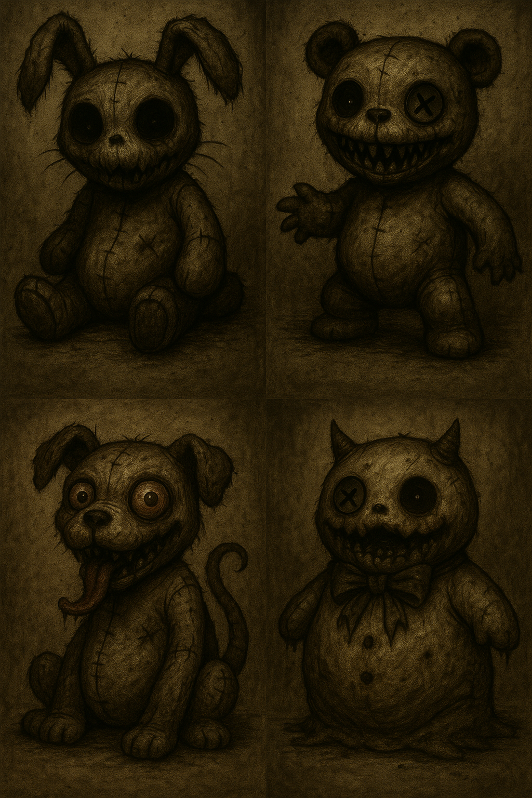

We did this several times until we found something we liked. In the end we used the rabbit on the top-left as our primary inspiration. We iterated over various other concept arts using the rabbit as a reference until we reached our final version seen below:

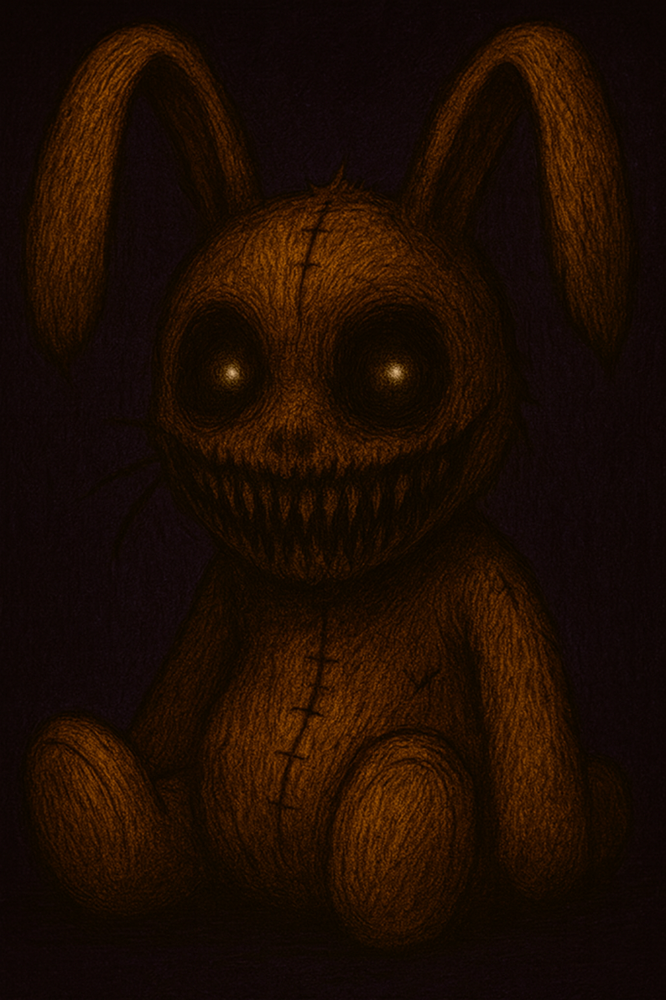

---

### Game Assets:

To generate our assets we used ChatGPT5 once again. We found references and then provided them to GPT along with a prompt to generate a spritesheet consisting of all the assets required in the scene (that being a boys room). In this particular case, given that creating a full spritesheet is a complicated task, we used ChatGPT5 Agent Mode, which was successful in creating a spritesheet.

> PROMPT: You are a professional pixel artist in game development. You are fantastic in creating sprite sheets that are unity-friendly, meaning each sprite is in its own 32x32 square (or larger if the object is longer in one direction, but keeping this pixel style). Make the background of the sprite sheet completely white. Generate such a sprite sheet based on the image provided, this should be the basis of the style of all objects. The sprite sheet should contain the following objects: a childs bed (make this one 32w x 64h), a bookcase, a plant, a stuffed toy bear, a carpet, a desk with a computer, a wardrobe, a childs chest, three unique childs toys, three unique hanging photo frames for a boys room, a lamp, a pinboard with an arrangement of notes and papers.

Reference:
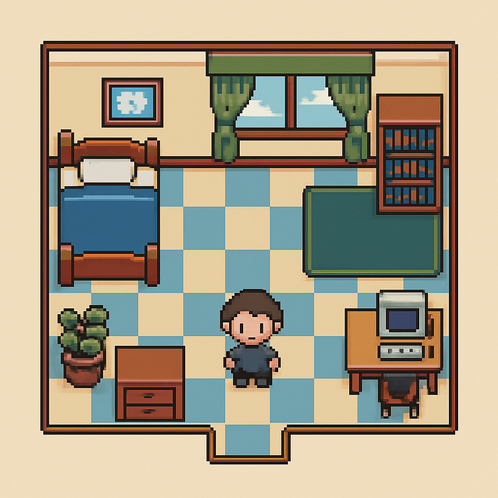

Generated Spritesheet:
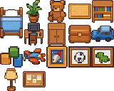

After generated the spritesheet, we used Aseprite to isolate each sprite, reduce the size to 32x32 resolution, and to make minor touchups. The same was done to generate tilesets.

---

### Main Menu and Gameover Screens

Retrodiffusion was used.

>*Prompt: Cinematic main menu background for a psychological horror game titled "Hide and Seek". The scene shows a dimly lit child’s bedroom at night. A soft bedside lamp casts a small pool of warm light, contrasting against deep blue moonlight filtering through the window. Toys and books are scattered on the carpet, slightly disordered. A small wooden desk holds a handwritten note from the boy’s mother — the paper looks aged and tinted yellow, the handwriting childlike but unnervingly uneven. One corner of the room fades into darkness where the closet door is slightly ajar, its interior pitch black. A subtle, almost imperceptible puppet’s silhouette or shadow can be seen in that darkness, just enough to cause unease. The overall tone mixes innocence and dread — a child’s room that should feel safe, yet something feels deeply wrong. The walls have colorful crayon drawings, but a few are disturbingly altered — eyes crossed out, smiles smeared, faint shapes hidden in the scribbles. The flashlight lies on the floor, its weak beam illuminating dust motes in the air. The game title “HIDE AND SEEK” appears centered in frame, drawn in childish crayon-style letters — slightly smeared, uneven, and unsettling, glowing faintly in the dark. Subtle fog or haze near the floor, hinting at something unnatural. Color palette: desaturated blues and browns, soft orange lamplight, pale moonlight contrast, gentle cinematic shadows. Mood: eerie, suspenseful, melancholic — childlike wonder tainted by fear. Lighting: low-key, cinematic, with realistic textures and volumetric depth. --style cinematic horror --lighting low key --realistic details --depth of field focus on the note and title text --mood hauntingly beautiful tension.*

Final Version:
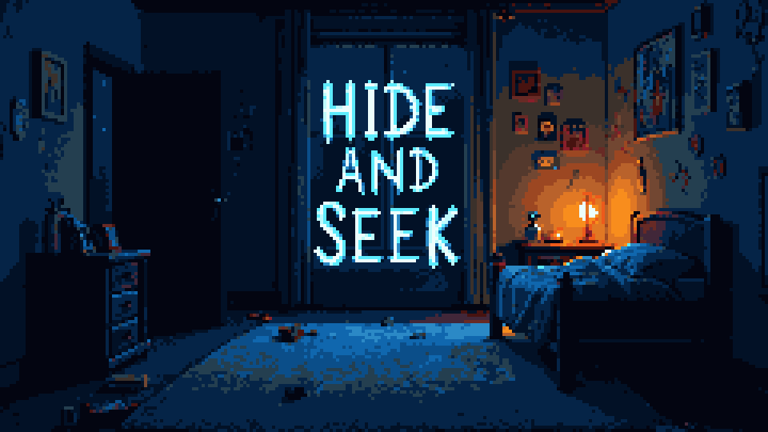

> *Prompt: Cinematic “Game Over” background for a psychological horror game titled "Hide and Seek". The scene takes place in the same child’s bedroom, but now it’s completely dark — the only light comes from the boy’s fallen flashlight, its beam weakly flickering across the floor. The room is in disarray: toys overturned, the chair toppled, the desk note crumpled and slightly torn. The closet door is now wide open, its interior pitch black, with faint puppet strings or small dangling limbs barely visible in the darkness — unclear if they’re real or imagined. The atmosphere is suffocatingly still, with faint dust floating through the weak flashlight beam. A subtle reddish tint or faint glow leaks from under the bed, hinting at something unnatural beneath. The title “HIDE AND SEEK” is faintly visible in the center of the image, distorted as if fading or decaying — drawn in the same childish crayon style as the main menu, but now smudged, uneven, and cracked. The walls appear slightly warped, the drawings distorted into faint faces or stretched smiles. Color palette: deep blacks, muted reds, pale blues, faint amber highlights. Lighting: single flickering light source from flashlight, strong contrast, cinematic shadows. Mood: dread, aftermath, quiet horror — the game has ended, but the presence remains. --style cinematic horror --lighting flickering --mood oppressive dread --realistic details --depth of field focus on flashlight and title text.*

Final Version:
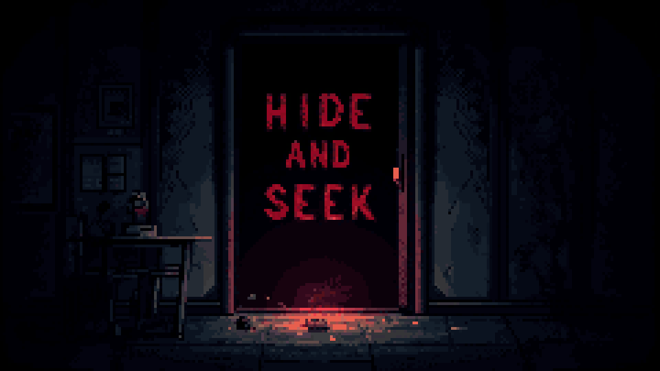

---

### Base Images and 'Differences'

The first phase of the game consistents of the player interacting with objects (e.g. wardrobe, bookcase, desk, etc.) in a room. Once interacting, an image appears showing the interacted object from the perspective of the playable character. Each new day there are differences in these images which the player must detect and click on. To generate these images, we first generated images of the interactable objects without any other objects/items on them. This allowed us to define the desired style for the images to ensure consistenty across all the images (once one was generated in the desired style, it was used as a reference). Additionally, sketches were provided to ChatGPT to give it a reference on the perspective we wanted

> PROMPT: You are an expert game artist. You excel at taking hand-drawn sketches and existing game sprites and converting them into images usable in a game. You are able to ensure that each image is created with a consistent style , which is cartoon-like with some but very little pixel influence. Additionally, you are able to ensure that each image is color and appearance consistent to the provided sprite. Your current project is a horror game where a little boy walks around his room and interacts with objects. Upon interacting with these objects, an image appears and the player must spot if there are any differences to the image based on the previous days. Your job is to create the base images that appear from these interactions. The aim is to make the base image simple and modular, so that later we can iterate on the images to easily add the differences which the user must spot. I will provide you with the sketches, sprites, and some basic information on what should be included, and then I want you to create the images based on everything I have told you thus far.

[EXAMPLE SKETCH]
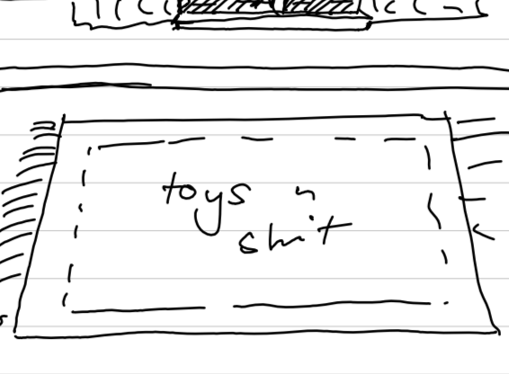

Asset Used:
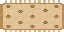

Final Image:
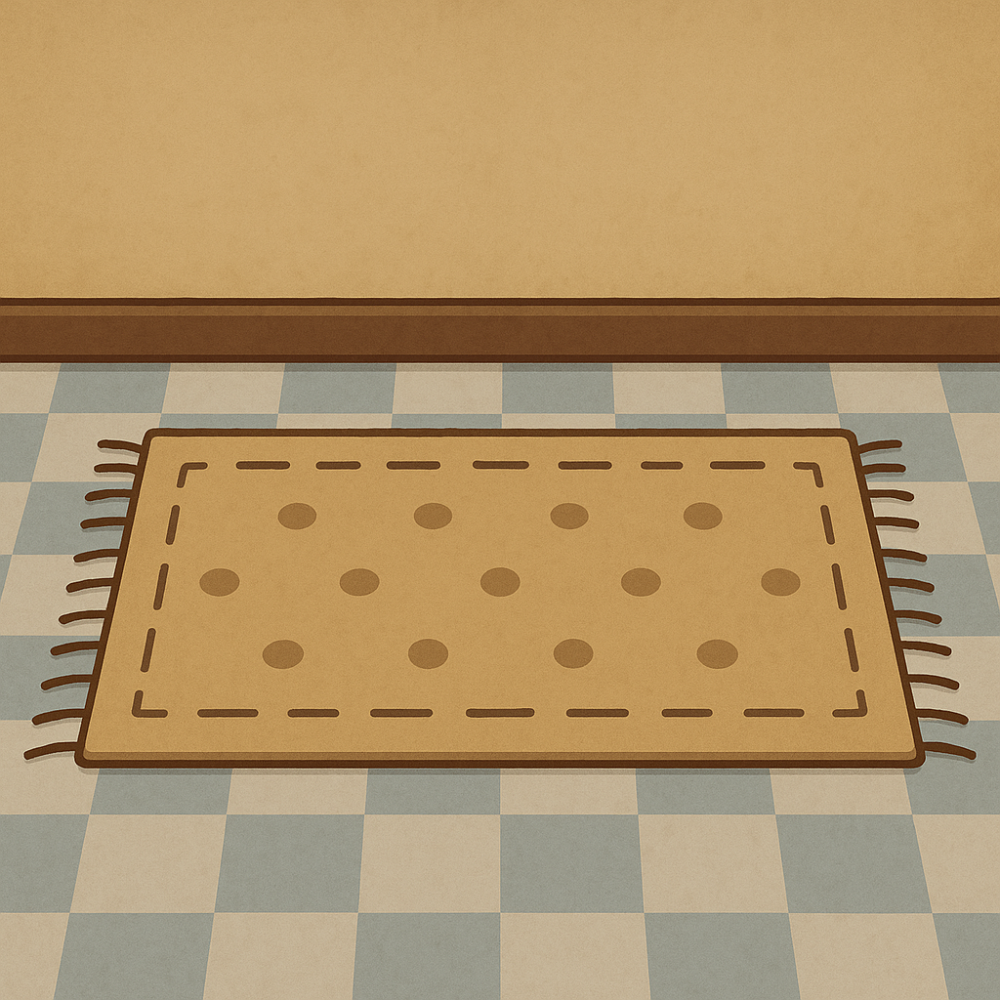

This was done for all the required images (total of 6). Occasionally there would be minor errors, but these could be easily fixed by feeding ChatGPT with the final image with the desired change. The main issues were either fixing the flooring/wall or making things look aesthetically nicer. For example, the final image above was iterated until we had a flower pattern on the carpet.

Once these images where generated, we iterated on them. By providing the model with the barren objects, we asked it to add populate the images with specific objects in specific locations. The was also done to ensure consistency across all the images and objects.

Example of populated scene:
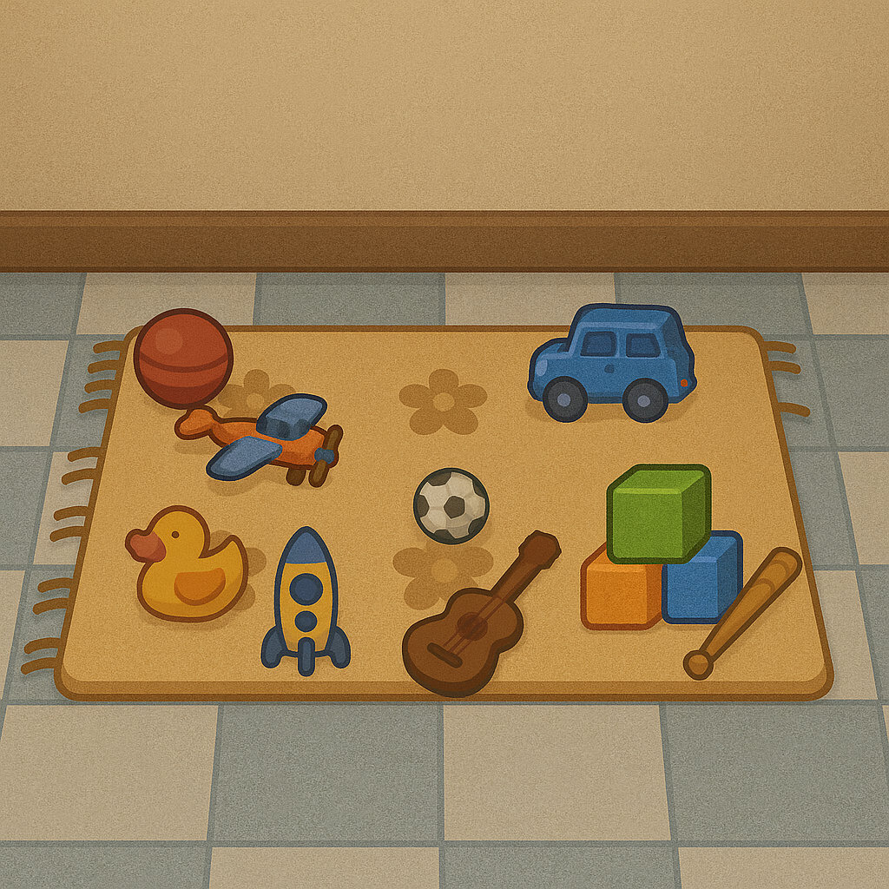

After the images were populated with items, we needed to generate the differences. To do so, we took a similar approach as above. The image (populated with objects) was provided to ChatGPT and then prompted to make a specific change. We decided to perform one difference per generation, as this would prevent overloading the model with too many tasks. We thought that asking for multiple differences in one image generation would lead inconsistencies in style and slight undesired changes. 

> PROMPT 1: Imagine you are a professional horror artist, renowned for your ability to create and modify chilling visual assets for horror games. Your current task involves altering specific details in images to incorporate horror-themed objects based on a given instruction, while maintaining the rest of the image unchanged. Here’s how you should proceed: 1. Await an image along with a detailed prompt specifying the required change. 2. Make the specified change in the image with precision, ensuring that no other aspects of the image are altered. 3. Provide a brief description of the changes you’ve made to verify the integrity of the alteration. Do you have the skills to reinterpret these visual assets while keeping the image intact?

> PROMPT 2: The duck is crying a magenta liquid

Final Image:
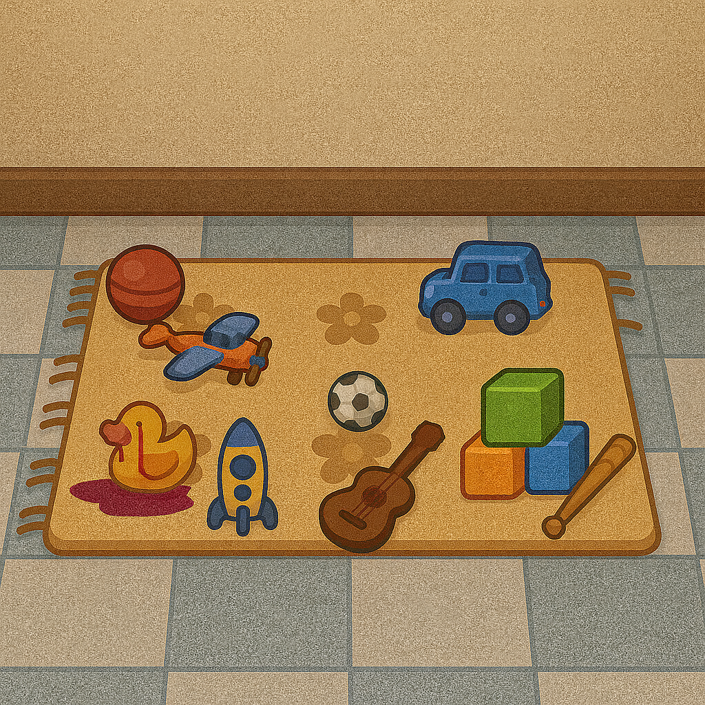

The resulting images were fairly good in quality and consistency. One primary downside in this approach was that the amount of 'noise' present in each generated image was not consistent. Some images had nearly no visible noise, whilst some other had a significant amount of it.

---

## Music and Sound Generation

### In-game Music

We took an unorthodox approach to music generation with generative models. Instead of using a model trained with sound, we used ChatGPT to generate Strudel code. Strudel is a coding platform that allows someone to program music with coding syntax. We provided the following prompt:

> PROMPT: You are an expert musician specializing in Strudel music code. Create Strudel code for an ambient soundtrack designed for a horror pixel game. Recreate lavender theme song from pokemon blue/red. Ensure the code is functional, well-commented, and optimized for looping seamlessly in a game environment. Additionally, ensure that the code can run on the base version of Strudel REPL (https://strudel.cc/).

This was done multiple times until a decent output was given. This basic song template from the model was then tweaked to our liking. We've found that this form of music generation is not entirely consistent. ChatGPTwould occasionally hallucinate and provide code that did not follow the Strudel syntax. Nevertheless, once it provided correct code, we found that this form of music generation is ideal for people who still want to have easy access to editing the music.

---

### SFX (Sound Effects)

All sound effects and ambient music were generated with a ComfyUI workflow designed to generate audio directly from text prompts using latent diffusion. Most of the generated assets were further polished with the software Audacity e.g., adjusting pitch and fade in and fade out, normalizing the volume, making the ambient sound loopable, noise removal etc.

1. Door Opening & Closing (CFG 6.0)
**Positive:**  
> old wooden door slowly creaking open, rusty hinges, horror ambience, close-up recording, dry sound, sound effect  

**Negative:**  
> wind noise, background chatter, footsteps, echo, reverb, metallic clang  

2. Footsteps (CFG 6.0)
**Positive:**  
> slow footsteps on creaky wooden floor, subtle floor hits, dark atmosphere, cinematic horror, close mic sound, realistic texture, sound effect  

**Negative:**  
> wind noise, background chatter, footsteps, echo, reverb, metallic clang 

3. Ambient Night 1 (CFG 6.0) / Game Over (CFG 5.5)
**Positive:**  
> eerie distorted ambience, deep drones, tension building, horror soundscape, subtle glitch texture, cinematic atmosphere, unsettling mood, sound effect  

**Negative:**  
> wind noise, background chatter, footsteps, echo, reverb, metallic clang 

4. Child Bedroom (CFG 5.0)
**Positive:**  
> daytime ambience in child’s bedroom, subtle unsettling undertone, nostalgic yet eerie, horror atmosphere, ambient soundscape, sound effect  

**Negative:**  
> wind noise, background chatter, footsteps, echo, reverb, metallic clang, loud screams, intense horror, melody, music, percussion, radio, electronic noise, dialogue  

5. Ambient Night 2 (CFG 5.0)
(same as *Child Bedroom*)  

6. Torchlight (CFG 6.0)
**Positive:**  
> small flashlight turning on, loud click switch, brief electrical buzz, battery-powered torch, subtle hum, realistic sound effect  

**Negative:**  
> echo, electrical, reverb, melody, distortion, voice, ambient noise  

7. Interaction Cues (CFG 6.0)
**Positive:**  
> subtle mechanical click, metal sound, soft whoosh, satisfying short interaction cue, game interface sound, clean dry sound effect  

**Negative:**  
> echo, electrical, reverb, melody, distortion, voice, ambient noise  

8. Screams 1 – 4 (CFG 5.0)
**Positive:**  
> creature dying sound, guttural roar fading out, squelch of flesh, breath stopping, horror cinematic realism, close mic, dry sound effect  

9. Screams 5 (CFG 5.5)
**Positive:**  
> demonic creature laughter, child-like laughter with glitch distortion, distorted growl, deep and echoing tone, unsettling and menacing, horror atmosphere, cinematic, sound effect  

10. Screams 6 – 8 (CFG 5.8)
**Positive:**  
> demonic scream, dying sound, guttural roar, squelch of flesh, breath stopping, horror cinematic realism, close mic, dry sound effect  

All Screams had:

**Negative (all screams):**  
> music, melody, rhythm, vocals, speech, background ambience, echo, reverb, distortion, low quality, hiss, metallic noise, unwanted artifacts, wind noise  

11. Heartbeat (CFG 6.0)
**Positive:**  
> slow rhythmic heartbeat, tense horror atmosphere, deep low thump, close microphone, realistic pulsing, cinematic tension, dry sound effect  

**Negative:**  
> music, melody, rhythm, vocals, speech, background ambience, echo, reverb, distortion, low quality, hiss, metallic noise, unwanted artifacts, wind noise  

---

## Animations/Video Generation

### Monster Jump Scare

Generating animations using ChatGPT was not a successful in our experience. We attempted to ask for spritesheets depicting animations, but these were never consistent nor easily usable. As a result, we decided that we would use ChatGPT to generate an initial frame and a final frame of an animation. This was a better alternative because the model would consistently provide good quality results when focusing on just one object/image to generate. 

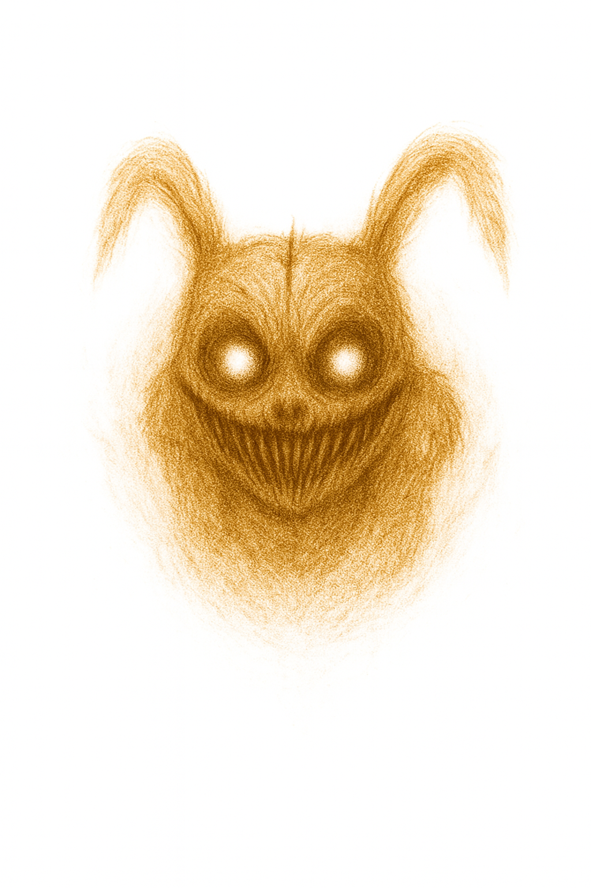

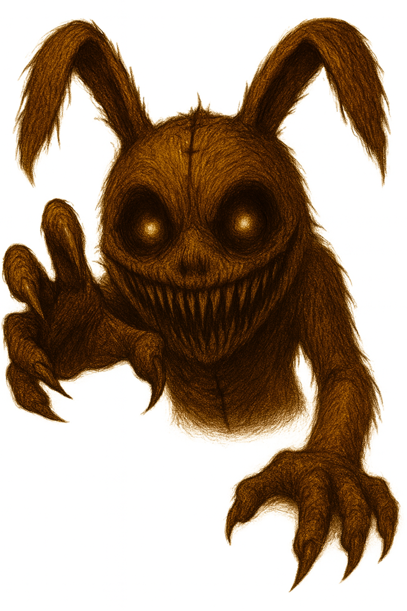

We then utilized these inital and final frames in a ComfyUI pipeline using wan2.2. This pipeline took both an inital frame, a final frame, and a text prompt to generate a video. We utilized the above generated images to create our animation of a monster lunging towards the screen. To keep within the style of our game, we used a pixelator and then only took a handful of frames from the video to use in our game.

---

### Player Animations

Retrodiffusion was used for this.

> PROMPT: *A top-down pixel art of a young boy character in pajamas, designed for a 2D RPG-style game. The boy has messy long hair, cute proportions, and soft blue or striped pajamas, is in classic pixel art style with clear outlines, 16-bit retro aesthetic, consistent lighting, and matching size and alignment. The background should be transparent, highly detailed, professional pixel art.*

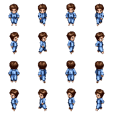
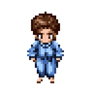

