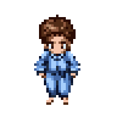
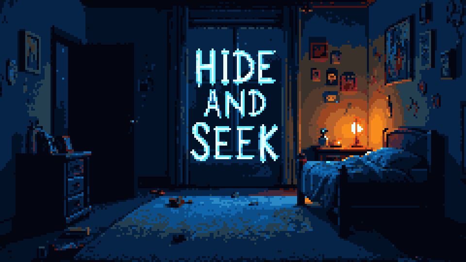

# Documentation of AI Conversations

## ...

# 1. Pixel Art

## 1.1 Tileset

## 1.2 Character Animations

For the character animations, the Retro Diffusion app was used https://www.retrodiffusion.ai/, specially tailored for generating pixel art.

| Parameter | Example Value |
|------------|----------------|
| **Model** | Animations |
| **Variant** | Walking \& Idle |
| **Settings** | 48 x 48 px |

**Prompts**:

##### Prompt 1 \[FINAL]

> *A top-down pixel art of a young boy character in pajamas, designed for a 2D RPG-style game. The boy has messy long hair, cute proportions, and soft blue or striped pajamas, is in classic pixel art style with clear outlines, 16-bit retro aesthetic, consistent lighting, and matching size and alignment. The background should be transparent, highly detailed, professional pixel art.*

##### Prompt 2

> *A top-down pixel art of a young boy character in pajamas, designed for a 2D RPG-style game. The boy looks sleepy, he has messy long hair, cute proportions, and soft blue or striped pajamas, is in classic pixel art style with clear outlines, 16-bit retro aesthetic, consistent lighting, and matching size and alignment. Highly detailed, professional pixel art.*

## 1.3 Images for Menus

Given the satisfactory results for the character animations, the Retro Diffusion app was used also for generating the various images for the menus - i.e.,  Main Menu and Game Over Menu.

| Parameter | Example Value |
|------------|----------------|
| **Model** | RD Plus |
| **Art Style** | Default |
| **Settings** | 240 x 135 px (scalable for 16:9 resolution) |

Prompt - Main Menu

>*Prompt: Cinematic main menu background for a psychological horror game titled "Hide and Seek". The scene shows a dimly lit child’s bedroom at night. A soft bedside lamp casts a small pool of warm light, contrasting against deep blue moonlight filtering through the window. Toys and books are scattered on the carpet, slightly disordered. A small wooden desk holds a handwritten note from the boy’s mother — the paper looks aged and tinted yellow, the handwriting childlike but unnervingly uneven. One corner of the room fades into darkness where the closet door is slightly ajar, its interior pitch black. A subtle, almost imperceptible puppet’s silhouette or shadow can be seen in that darkness, just enough to cause unease. The overall tone mixes innocence and dread — a child’s room that should feel safe, yet something feels deeply wrong. The walls have colorful crayon drawings, but a few are disturbingly altered — eyes crossed out, smiles smeared, faint shapes hidden in the scribbles. The flashlight lies on the floor, its weak beam illuminating dust motes in the air. The game title “HIDE AND SEEK” appears centered in frame, drawn in childish crayon-style letters — slightly smeared, uneven, and unsettling, glowing faintly in the dark. Subtle fog or haze near the floor, hinting at something unnatural. Color palette: desaturated blues and browns, soft orange lamplight, pale moonlight contrast, gentle cinematic shadows. Mood: eerie, suspenseful, melancholic — childlike wonder tainted by fear. Lighting: low-key, cinematic, with realistic textures and volumetric depth. --style cinematic horror --lighting low key --realistic details --depth of field focus on the note and title text --mood hauntingly beautiful tension.*

Iteration 1 \[FINAL\]

Iteration 2

Prompt - Game Over Menu

> *Prompt: Cinematic “Game Over” background for a psychological horror game titled "Hide and Seek". The scene takes place in the same child’s bedroom, but now it’s completely dark — the only light comes from the boy’s fallen flashlight, its beam weakly flickering across the floor. The room is in disarray: toys overturned, the chair toppled, the desk note crumpled and slightly torn. The closet door is now wide open, its interior pitch black, with faint puppet strings or small dangling limbs barely visible in the darkness — unclear if they’re real or imagined. The atmosphere is suffocatingly still, with faint dust floating through the weak flashlight beam. A subtle reddish tint or faint glow leaks from under the bed, hinting at something unnatural beneath. The title “HIDE AND SEEK” is faintly visible in the center of the image, distorted as if fading or decaying — drawn in the same childish crayon style as the main menu, but now smudged, uneven, and cracked. The walls appear slightly warped, the drawings distorted into faint faces or stretched smiles. Color palette: deep blacks, muted reds, pale blues, faint amber highlights. Lighting: single flickering light source from flashlight, strong contrast, cinematic shadows. Mood: dread, aftermath, quiet horror — the game has ended, but the presence remains. --style cinematic horror --lighting flickering --mood oppressive dread --realistic details --depth of field focus on flashlight and title text.*

Iteration 1

Iteration 2

Iteration 3

Iteration 4 - \[FINAL\]

Iteration 5 - \[FINAL\]

# 2. Sound Effects Creation

## Overview
All sound effects and ambient music were generated with a ComfyUI workflow designed to generate audio directly from text prompts using latent diffusion. Most of the generated assets were further polished with the software Audacity e.g., adjusting pitch and fade in and fade out, normalizing the volume, making the ambient sound loopable, noise removal etc.

## Model Configuration

| Model | File | Source |
|--------|------|--------|
| **CLIP Encoder** | `t5-base.safetensors` | [Hugging Face – google/t5-base](https://huggingface.co/google-t5/t5-base) |
| **Checkpoint** | `stable-audio-open-1.0.safetensors` | [Hugging Face – stabilityai/stable-audio-open-1.0](https://huggingface.co/stabilityai/stable-audio-open-1.0) |

## Workflow Parameters

| Node | Purpose | 
|------|------|
| **CheckpointLoaderSimple** | Loads the `stable-audio-open-1.0.safetensors` model (Stable Audio Open 1.0). |
| **CLIPLoader** | Loads the `t5-base.safetensors` CLIP text encoder. |
| **CLIPTextEncode (Positive/Negative)** | Encodes the descriptive text prompts into conditioning for generation. |
| **EmptyLatentAudio** | Initializes a latent audio tensor of a specified duration (e.g. 47.6 s). |
| **KSampler** | Diffusion sampler controlling CFG, steps, and denoise strength. |
| **VAEDecodeAudio** | Decodes latent audio output into waveform. |
| **SaveAudio** | Exports generated `.wav` files to the defined output path. |
| **MarkdownNote** | Provides workflow documentation or external reference link. |

---

## Sampling Parameters (KSampler)

| Parameter | Example Value |
|------------|----------------|
| **Seed** | 414831476524585 |
| **Steps** | 50 |
| **CFG (Guidance)** | 4.98 – 6.0 |
| **Sampler Name** | `dpmpp_3m_sde_gpu` |
| **Scheduler** | `exponential` |
| **Denoise** | 1.0 |

---

## Prompts and Parameter Settings for each SFX

Below are the structured prompts and parameter settings for each generated assets. Most of the parameter tweaking happened for the cfg parameter and the positive (desired features) and negative (undesired) prompts.
The cfg parameter was tweaked such that for more "unrealistic" sounds, the sound generation had more freedom, whereas for more realistic sounds - e.g., torchlight, footsteps - the parameter value was increased in order to generate something more similar to the source data. 

### 1. Door Opening & Closing (CFG 6.0)
**Positive:**  
> old wooden door slowly creaking open, rusty hinges, horror ambience, close-up recording, dry sound, sound effect  

**Negative:**  
> wind noise, background chatter, footsteps, echo, reverb, metallic clang  

### 2. Footsteps (CFG 6.0)
**Positive:**  
> slow footsteps on creaky wooden floor, subtle floor hits, dark atmosphere, cinematic horror, close mic sound, realistic texture, sound effect  

**Negative:**  
> wind noise, background chatter, footsteps, echo, reverb, metallic clang  

### 3. Ambient Sounds

#### Ambient Night 1 (CFG 6.0) / Game Over (CFG 5.5)
**Positive:**  
> eerie distorted ambience, deep drones, tension building, horror soundscape, subtle glitch texture, cinematic atmosphere, unsettling mood, sound effect  

**Negative:**  
> wind noise, background chatter, footsteps, echo, reverb, metallic clang 

#### Child Bedroom (CFG 5.0)
**Positive:**  
> daytime ambience in child’s bedroom, subtle unsettling undertone, nostalgic yet eerie, horror atmosphere, ambient soundscape, sound effect  
**Negative:**  
> wind noise, background chatter, footsteps, echo, reverb, metallic clang, loud screams, intense horror, melody, music, percussion, radio, electronic noise, dialogue  

#### Ambient Night 2 (CFG 5.0)
(same as *Child Bedroom*)  

### 4. Torchlight (CFG 6.0)
**Positive:**  
> small flashlight turning on, loud click switch, brief electrical buzz, battery-powered torch, subtle hum, realistic sound effect  

**Negative:**  
> echo, electrical, reverb, melody, distortion, voice, ambient noise  

### 5. Interaction Cues (CFG 6.0)
**Positive:**  
> subtle mechanical click, metal sound, soft whoosh, satisfying short interaction cue, game interface sound, clean dry sound effect  
**Negative:**  
> echo, electrical, reverb, melody, distortion, voice, ambient noise  

### 6. Screams

**Negative (all screams):**  
> music, melody, rhythm, vocals, speech, background ambience, echo, reverb, distortion, low quality, hiss, metallic noise, unwanted artifacts, wind noise  

#### Screams 1 – 4 (CFG 5.0)
**Positive:**  
> creature dying sound, guttural roar fading out, squelch of flesh, breath stopping, horror cinematic realism, close mic, dry sound effect  

#### Screams 5 (CFG 5.5)
**Positive:**  
> demonic creature laughter, child-like laughter with glitch distortion, distorted growl, deep and echoing tone, unsettling and menacing, horror atmosphere, cinematic, sound effect  

#### Screams 6 – 8 (CFG 5.8)
**Positive:**  
> demonic scream, dying sound, guttural roar, squelch of flesh, breath stopping, horror cinematic realism, close mic, dry sound effect  

### 7. Heartbeat (CFG 6.0)
**Positive:**  
> slow rhythmic heartbeat, tense horror atmosphere, deep low thump, close microphone, realistic pulsing, cinematic tension, dry sound effect  
**Negative:**  
> music, melody, rhythm, vocals, speech, background ambience, echo, reverb, distortion, low quality, hiss, metallic noise, unwanted artifacts, wind noise  

---

## Examples for Further Polish
Below are some examples of the generated sound effects and the succesive final result after polishing.

| SFX | AI Generated | Polished |
|------------|----------------|- |
| **Torchlight On** | [Source](./Assets/Sounds/sources/torchlighton-hum-off.flac) |[Polished](./Assets/Sounds/SFX/torchlight-on.wav) |
| **Torchlight Off** | [Source](./Assets/Sounds/sources/torchlighton-hum-off.flac) |[Polished](./Assets/Sounds/SFX/torchlight-off.wav) |
| **Torchlight Hum (loop)** | [Source](./Assets/Sounds/sources/torchlighton-hum-off.flac) |[Polished](./Assets/Sounds/SFX/torchlight-hum-loop.wav) |
| **Ambient Night (loop)** | [Source](./Assets/Sounds/sources/ambient-night-1.flac) |[Polished](./Assets/Sounds/SFX/ambient-night-loop.wav) |
| **Door Opening** | [Source](./Assets/Sounds/sources/dooropening-1.wav) |[Polished](./Assets/Sounds/SFX/door-open.wav) |
| **Door Closed** | [Source](./Assets/Sounds/sources/dooropening-1.wav) |[Polished](./Assets/Sounds/SFX/door-close.wav) |

To explore more, the AI generated sound effects and their polished versions can be found respectively in the folders [Assets/Sounds/sources/](./Assets/Sounds/sources/) and [Assets/Sounds/SFX/](./Assets/Sounds/SFX/).